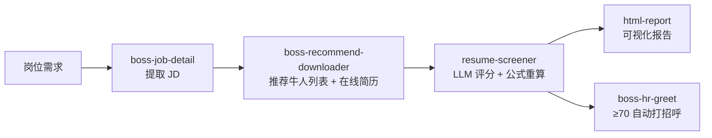

# BOSS 直聘 · HR 智能体技能包

> [!NOTE]
> 由 **7 个 AI 智能体 Skill** 组成，基于 [boss-agent-cli](https://github.com/can4hou6joeng4/boss-agent-cli) 实现 BOSS 直聘简历筛选的**全流程自动化**：从岗位到可视化报告，一键搞定。

<p align="center">
  
  
  
  
</p>

---

## 📑 目录

- [✨ 这是什么](#-这是什么)
- [🎯 核心能力](#-核心能力)
- [🧩 技能一览与工作流](#-技能一览与工作流)
- [🚀 快速开始](#-快速开始)
- [🧠 评分系统](#-评分系统)
- [🛡️ 安全与风控](#️-安全与风控)
- [📂 项目结构](#-项目结构)
- [📤 输出文件](#-输出文件)
- [⚙️ 环境变量](#️-环境变量)
- [🔗 相关链接](#-相关链接)

---

## ✨ 这是什么

你有一个岗位，剩下的交给 AI：

```
   岗位          →   AI 自动提取 JD   →   自动下载候选人简历   →   自动评分排名   →   自动打招呼 + 可视化报告
(一句话需求)        (boss-job-detail)      (boss-recommend-downloader)    (resume-screener)     (boss-hr-greet + html-report)
```

**一句话概括：** AI 帮你在几十份简历中，几分钟内筛出最匹配的那几个，自动给高分候选人打招呼，并告诉你该和每个人聊什么。

---

## 🎯 核心能力

| 能力 | 说明 |
|:----:|------|
| 🔍 **JD 提取** | 一键抓取岗位详情、任职要求与核心技能点 |
| 📥 **简历获取** | 从推荐牛人页面获取完整简历，真实浏览器指纹，低风控 |
| 🧮 **智能评分** | 5 维度加权评分 + 学历分档校准，硬门槛过滤 |
| 📬 **自动打招呼** | 给 ≥70 分的推荐 tier 候选人自动点 BOSS 打招呼按钮 |
| 📊 **可视化报告** | 排名表 + 五维雷达图 + 个性化沟通建议，HTML 一键生成 |
| 🧪 **可测试** | 核心算法由 `tests/` 单元测试用例覆盖 |

> **🚪 `boss-hr-auto` 是唯一入口**，其余 Skill 是其子步骤。使用时始终从 `boss-hr-auto` 开始。

---

## 🧩 技能一览与工作流

| # | Skill | 角色 | 作用 |
|:-:|------|:----:|------|
| 0 | **boss-hr-auto** | 🚪 入口 | 编排全流程工作流（唯一入口，5 步串到底） |
| 1 | boss-agent-cli | 📖 参考 | BOSS CLI 命令手册（被其他 Skill 引用） |
| 2 | boss-job-detail | Step 1 | 提取岗位 JD |
| 3 | **boss-recommend-downloader** | Step 2 | 从推荐牛人页面获取完整简历（含 run_all 一把梭） |
| 4 | resume-screener | Step 3 | 硬门槛过滤 + 加权评分 + 学历分档 |
| 5 | html-report | Step 4 | 生成可视化 HTML 报告 + 沟通建议 |
| 5+ | **boss-hr-greet** | Step 5 | 给高分候选人自动打招呼（主流程自动触发） |

### 工作流示意图



---

## 🚀 快速开始

> **无需打包任何二进制文件。** 以下全部通过包管理器安装，浏览器用系统自带的即可。

### 前置依赖

| 依赖 | 说明 | 安装方式 |
|------|------|---------|
| Python 3.10+ | 运行脚本 | [python.org](https://python.org) |
| [boss-agent-cli](https://github.com/can4hou6joeng4/boss-agent-cli) | BOSS 直聘 CLI | `uv tool install boss-agent-cli` |
| patchright | CDP 客户端（**不含浏览器，不下载 Chromium**） | `pip install patchright` |
| Chrome / Edge | 系统自带即可 | 已装直接跳过 |

### 1. 安装

```bash
# boss CLI
uv tool install boss-agent-cli

# Python 依赖
pip install patchright
```

### 2. 启动 CDP 浏览器

**Windows（推荐自带 Edge）：**

```powershell
Start-Process "msedge" -ArgumentList `
  "--remote-debugging-port=9222", `
  "--user-data-dir=$env:USERPROFILE\.workbuddy\chrome-profiles\boss-cdp"
```

**macOS / Linux：**

```bash
google-chrome \
  --remote-debugging-port=9222 \
  --user-data-dir="$HOME/.workbuddy/chrome-profiles/boss-cdp"
```

### 3. 登录

```bash
# 浏览器扫码 → 提取到 CLI
boss login --cdp --timeout 30

# 验证（必须两步都通过）
boss --role recruiter me
boss --role recruiter --platform zhipin --cdp-url http://localhost:9222 hr jobs list
```

### 4. 关闭低风险模式（简历下载必需）

```bash
# 创建/编辑配置文件
cat > ~/.boss-agent/config.json << 'EOF'
{
  "low_risk_mode": false,
  "platform": "zhipin",
  "role": "recruiter"
}
EOF
```

> [!WARNING]
> **必须关闭**：`low_risk_mode` 默认开启会阻止简历获取。

### 5. 开始使用

在智能体中调用：

```
@skill://boss-hr-auto 车架工程师
```

或直接说：

```
帮我筛选车架工程师的简历
```

---

## 🧠 评分系统

### 当前权重（5 维加权求和）

> [!NOTE]
> 当前 `resume-screener/scripts/score_resumes.py` 已统一为**单套 5 维权重**（合计 100%）。如需区分岗位类型，建议在 `WEIGHTS` 常量上扩展，不要直接硬编码多套。

| 维度 | 权重 | 评分方法 |
|------|:----:|---------|
| 学历 (edu) | **25%** | `validate_score()` 用 `school_tier.py` 分档表**强制覆盖** LLM 给的 edu 分；硕士 +8% |
| 工作经验 (exp) | **25%** | 相关经验年限 + 业务匹配度 |
| 专业技能 (skill) | **25%** | JD 技能覆盖率 |
| 项目经历 (proj) | **15%** | 项目复杂度 + 相关性 |
| 专业匹配 (major) | **10%** | 对口=100%，相关=80%，无关=30-60% |

### 总分与档位

- `weighted[d] = round(dims[d] * WEIGHTS[d], 2)`
- `total = round(sum(weighted.values()), 1)`
- 档位阈值：`>= 70` → **推荐**　`>= 60` → **待定**　否则 → **不推荐**
- 全部逻辑在 `resume-screener/scripts/score_resumes.py`，由 `tests/` 下的单元测试用例覆盖：`python -m pytest tests/`

### 学历分档表

| 档次 | 分数 | 示例 |
|------|:----:|------|
| C9 | 100 | 清华、北大、复旦、交大等 |
| 985 | 92 | 其他 985 高校 |
| 211 | 85 | 其他 211 高校 |
| 双一流 | 77 | 双一流建设高校 |
| 一本公办 | 71 | 省属重点一本 |
| 二本公办 | 62 | 普通公办二本 |
| 民办本科 | 53 | 民办高校、独立学院 |

> [!IMPORTANT]
> 学历评分必须严格执行分档表，**禁止给所有人相同分数**。

### 行动建议规则

输出格式：`📊 排名表（含 5 维加权分）+ 📋 每人评分依据 + 🎯 个性化行动建议`

- **推荐面试**：每人必须写「候选人背景」+「沟通方向」
- **待沟通确认**：每人必须写「优势」+「需确认问题」
- ❌ 禁止所有人使用相同的沟通方向

---

## 🛡️ 安全与风控

### 推荐牛人下载

| 做法 | 说明 |
|:----:|------|
| ✅ 真实浏览器 TLS 指纹 | 通过 patchright 在 Edge 内 fetch，服务器无法区分真人 |
| ✅ 滚动延迟 3-6 秒随机 | 模拟真人浏览 |
| ✅ 简历获取 5-15 秒随机 | 模拟真人阅读 |
| ✅ 建议工作时间运行 | 9:00-18:00 |
| ✅ 单次建议不超过 50 人 | 超过则分批次 |

### 通用规则

- ❌ 不自动发消息（CLI 权限不足）
- ✅ 批量操作间隔随机延迟
- ✅ 增量同步（已下载简历自动跳过）
- ✅ Cookie 优先从浏览器本地提取

### 风控检测维度

| 维度 | 安全做法 | 危险做法 |
|------|---------|---------|
| 请求频率 | 5-20 秒随机 | 固定间隔或高频 |
| 操作时间 | 工作时间 | 凌晨 |
| 行为模式 | 有滚动有停顿 | 纯 API 无页面交互 |
| 总量控制 | 分批次 | 一次几百个 |

---

## 📂 项目结构

```
boss-hr-agent-toolkit/
├── README.md                          # 本文件
├── FILE_MANAGEMENT.md                 # 文件管理规范
├── .gitignore
│
├── boss-hr-auto/                      # 🚪 全流程编排（唯一入口）
│   ├── SKILL.md
│   └── scripts/auto_pipeline.py        # 一把梭串 Step 1→5
│
├── boss-agent-cli/                    # 📖 CLI 命令参考
│   ├── SKILL.md
│   └── scripts/
│       ├── boss_login_guard.py        # 登录守护
│       └── patch_stoken.py            # stoken 补丁
│
├── boss-job-detail/                   # Step 1：JD 提取
│   ├── SKILL.md
│   └── scripts/boss_jd.py
│
├── boss-recommend-downloader/         # Step 2：推荐牛人列表 + 在线简历
│   ├── SKILL.md
│   └── scripts/
│       ├── recommend_list.py          # 获取候选人列表
│       ├── recommend_download.py      # 批量获取简历（patchright + fetch）
│       └── run_all.py                 # 一键运行（list + download）
│
├── resume-screener/                   # Step 3：评分系统
│   ├── SKILL.md
│   └── scripts/
│       ├── score_resumes.py           # 加权评分 + 分档校准
│       └── school_tier.py             # 学历分档表
│
├── html-report/                       # Step 4：报告生成
│   ├── SKILL.md
│   ├── scripts/generate_html_report.py
│   └── templates/report.html
│
├── boss-hr-greet/                     # Step 5：自动打招呼（主流程自动触发）
│   ├── SKILL.md
│   └── scripts/auto_greet.py          # 位置表 + 倒序招呼
│
├── shared/                            # 共享工具
│   ├── output_manager.py              # 统一文件路径管理
│   ├── run_orchestrator.py            # 跨 Step run_id 编排
│   ├── job_resume_store.py            # 候选人键 + 状态读写 + 简历合并
│   ├── human_interaction.py           # 拟人鼠标移动
│   └── fix_encoding.py                # 编码修复
│
└── tests/                             # 单元测试
    ├── conftest.py
    ├── test_school_tier.py
    └── test_score_resumes.py
```

---

## 📤 输出文件

所有输出自动保存到：

```
~/Desktop/boss-hr-output/
└── <岗位名>/
    ├── <岗位名>_统一方案.html          # 最终 HTML 报告
    └── process/                       # 过程文件（留痕查阅）
        ├── job_detail.json            # JD 数据
        ├── recommend_geek_ids.json    # 累计候选人 ID
        ├── test_resumes.json          # 累计所有简历
        └── screening_results.json     # 评分结果
```

> [!TIP]
> - 禁止在桌面散落文件；HTML 报告放岗位文件夹根目录，中间数据放 `process/`
> - 临时 Python 脚本任务结束后删除
> - 复用 skill 内已有的 Python 脚本，禁止重复造轮子
>
> 详见 [FILE_MANAGEMENT.md](FILE_MANAGEMENT.md)。

---

## ⚙️ 环境变量

| 变量 | 说明 | 默认值 |
|------|------|--------|
| `BOSS_BIN` | boss CLI 路径 | `boss` |
| `CDP_URL` | 浏览器 CDP 调试地址 | `http://localhost:9222` |
| `PYTHONHOME` | **必须清空** | `""` |
| `PYTHONIOENCODING` | 避免 CLI 编码问题 | `utf-8` |

---

## 🔗 相关链接

- [boss-agent-cli](https://github.com/can4hou6joeng4/boss-agent-cli) — 底层 CLI 工具
- [patchright](https://github.com/Kaliiiiiiiiii-Vinyzu/patchright) — Playwright 分支（CDP 浏览器控制）

---

## 📄 License

[MIT](https://opensource.org/licenses/MIT)
